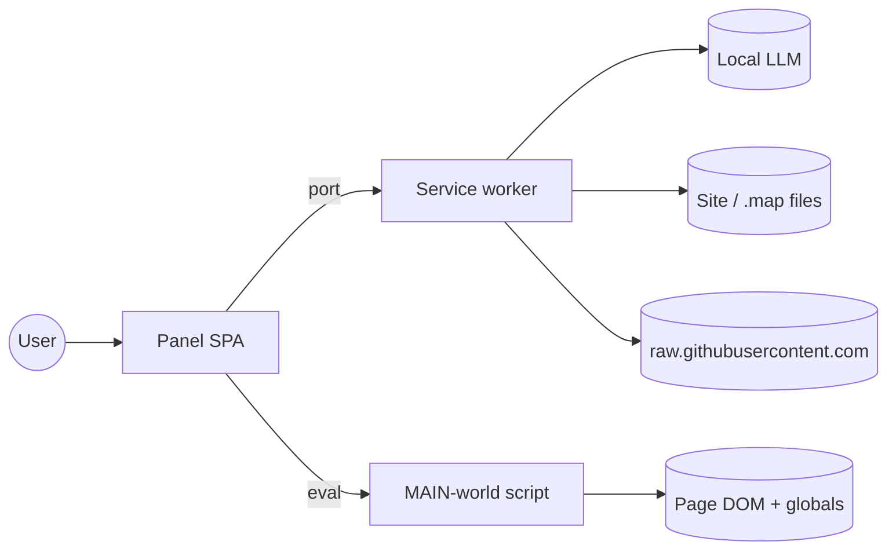

# DOM Lens — System Design

A design-level view of DOM Lens: what it is optimising for, the hard
constraints imposed by Chrome's extension platform, the alternatives that
were considered and rejected, how it fails, how it scales to large pages,
and what it costs to run. For the component-level picture see
[architecture.md](architecture.md); for the decision log see
[adr/](adr/README.md).

---

## 1. Goals

1. **Explain a running page, not a repository.** Give a frontend engineer
   a snapshot of what actually shipped — DOM, React tree, federation
   topology, loaded bundles and their original sources — on any site,
   without access to its build.
2. **Local-first AI.** Every analysis goes to a model on the developer's
   machine (LM Studio, Ollama, llama.cpp). The extension must work with
   8B-class models and small context windows, so every prompt is
   budgeted and the heavy lifting (classification, skeleton extraction,
   sourcemap parsing) happens without an LLM.
3. **No footprint on the inspected page.** No yellow "being debugged"
   bar, no patched React DevTools hook, no cookies sent, no persistent
   changes to the page.
4. **Explorable, not just readable.** Trees and graphs first; text
   reports second. Navigation should work before any model call.

### Non-goals

- Replacing React DevTools or the Sources panel.
- Cloud sync, accounts, telemetry.
- Supporting browsers without MV3 `world: 'MAIN'` content scripts.

---

## 2. Constraints

### 2.1 DevTools extension model

- A DevTools extension can only call `chrome.devtools.*` from the
  DevTools page; the panel is an ordinary extension page that receives
  `inspectedWindow.eval` and `network` access through it.
- `chrome.devtools.inspectedWindow.eval` is **synchronous-only** from the
  page's perspective: it does not await Promises. Anything asynchronous in
  the MAIN world (lazy-load priming, smooth scrolling) must be split into
  a *start* call and a *poll* call. `startPrimeLazyLoad` /
  `getPrimeLazyLoadStatus` exist for exactly this reason.
- `eval` results must be JSON-serialisable. Fiber objects and DOM nodes
  are converted to plain `ComponentNode` records with numeric bounds
  before they cross the boundary.

### 2.2 MV3 isolation boundaries

| Context | Can see | Cannot see |
|---|---|---|
| Panel page | `chrome.storage`, `chrome.runtime` port, React state | Page globals, page DOM, arbitrary network (CORS) |
| Background service worker | Any URL via `fetch` (host permission), `chrome.tabs.captureVisibleTab`, `chrome.scripting` | Page DOM, DevTools APIs; may be suspended when idle |
| MAIN-world content script | `window.*`, fiber roots, `__webpack_require__`, real DOM | `chrome.*` (except `runtime.sendMessage` in ISOLATED world) |
| Sandboxed artifact iframe | Its own HTML/JS | Everything else (null origin) |

Consequences: the panel orchestrates, the worker does I/O, the injected
script reads the page. There is no shared memory — everything is copied
through messages, which is why size caps exist on every hop.

### 2.3 Content Security Policy

Extension pages run under `script-src 'self'`. No `eval`, no
`new Function`, no inline `<script>`. This ruled out `source-map-js`
(ADR-0003) and any highlighter that compiles grammars at runtime.

### 2.4 Chrome quotas

- `captureVisibleTab` is rate-limited to roughly two calls per second per
  window. Tile captures are spaced ≥ 600 ms apart and retried with
  exponential backoff.
- Six concurrent connections per origin. The probe pool caps at four to
  leave headroom for the page itself.

### 2.5 Local model limits

Typical local servers run one model with 4–8 K tokens of context and a few
inference slots. Prompts are therefore composed from *summaries plus a
curated sample* (module analyses) or *one file / one symbol* (file
analyses), never whole bundles.

---

## 3. Architecture summary

Four execution contexts, one typed message protocol
(`lib/bridge/protocol.ts`), one flat Zustand store. The full diagrams,
C4 views and sequence diagrams live in [architecture.md](architecture.md).

---

## 4. Alternatives considered and rejected

| Decision | Chosen | Rejected | Why |
|---|---|---|---|
| Reaching page globals | `inspectedWindow.eval` into MAIN world | ISOLATED content script + `postMessage` bridge | Bridge adds a hop, latency and a second serialisation; MAIN world is where `__webpack_require__` and fiber roots live. Bridge kept as a placeholder for CSP-locked pages. (ADR-0001) |
| Console / error capture | Patch `console.*` in the injected script | `chrome.debugger` (CDP `Runtime.consoleAPICalled`) | The debugger API shows the yellow "Chrome is being debugged" bar and kicks other debuggers off the tab. Trade-off: unhandled rejections that bypass `console` are missed. (ADR-0002) |
| Finding React roots | Read-only DOM scan for `__reactContainer$*` | Install / patch `__REACT_DEVTOOLS_GLOBAL_HOOK__` | A shim crashed React DevTools' `registerRenderer` when DOM Lens loaded first; patching an existing hook raced its commit path. (ADR-0006) |
| Sourcemap decoding | `@jridgewell/sourcemap-codec` (VLQ only) | `source-map-js` / `source-map` | They build lookup tables with `new Function`, which the extension CSP blocks. We only need per-source byte attribution, not `originalPositionFor`. (ADR-0003) |
| GitHub access | Unauthenticated raw reads, user-defined URL→repo mappings | Store a PAT in `chrome.storage` and call the API | A stored token is readable by any code running in the extension; the value (private repos) did not justify the exposure. (ADR-0004) |
| Large minified bundles | Regex skeleton + per-symbol LLM summaries | Whole-file LLM beautify; shipping acorn / tree-sitter | Beautify is minutes per MB and unreadable anyway; a real parser adds 150–200 KB to the content script. Skeleton covers ~80 % of real-world structure in < 1 s. (`docs/CODE_MAPPING.md`) |
| LLM transport | Background SW proxy with SSE parsing | `fetch` from the panel | Panel origin is `chrome-extension://…`; local servers rarely send matching CORS headers and often mishandle preflight. |
| UI state | Single flat Zustand store | Redux / slices / React Context per feature | ~20 state keys; slices would add ceremony without isolation benefits. |
| Tree component lifecycle | Keep mounted with `display:none` | Unmount on tab switch | react-arborist's `ResizeObserver` measured zero on remount and the tree stayed miniaturised. (ADR-0005) |

---

## 5. Failure modes and handling

| Failure | Detection | Behaviour |
|---|---|---|
| MAIN-world script absent (page loaded before extension install, or stale version) | `ping()` / `version` mismatch via `eval` | Capture aborts with "main-world script not present — reload the page"; nothing else is attempted |
| Page blocks `eval` via CSP | `inspectedWindow.eval` returns an exception | Capture error surfaced; ISOLATED bridge is the documented future path |
| `captureVisibleTab` quota exceeded | Rejection from Chrome | 4 retries with 600 ms → 4.8 s backoff; on final failure the full-page path falls back to viewport-only and the error is shown next to the snapshot |
| Scroll-locked / nested-scroll page | `getScrollPosition()` after `scrollTo()` shows no movement | Full-page capture aborts early with reason; viewport fallback |
| Lazy-load priming never settles | 45 s timeout on the poll | Proceed with the last measured height |
| Sourcemap 404 returned as 200 HTML | `JSON.parse` fails | `SourcemapFetchError{step:'parse'}` with the first 80 chars of the body so the user recognises an HTML page |
| Sourcemap > 32 MB | `arrayBuffer().byteLength` check in the SW | Explicit "response too large (cap is 32 MB)" message; no partial parse |
| Server rejects `HEAD` | `fetch` throws | Retry as `GET` with `Range: bytes=0-0` |
| Hostile / cross-origin globals while detecting federation | Property access throws | `tryGet` swallows; iframe-named globals skipped; a top-level throw becomes a `detect_error:` signal instead of failing capture |
| LLM server unreachable / non-2xx | `res.ok` false or network error | `lm.*.error` with status and body; Test connection in Settings lists models to diagnose |
| Model emits broken Mermaid | mermaid parse throws | Error shown inline with Heal-with-AI that feeds source + error back to the model |
| DevTools closed mid-stream | `port.onDisconnect` | All `AbortController`s aborted; overlay removed from the page via `chrome.scripting` |
| Service worker suspended | Port disconnect on the panel side | `usePort` reconnects and re-sends `panel.hello` |

---

## 6. Scaling to large DOMs and bundles

**DOM.** Markdown serialisation runs on a clone with `script`/`style`/`svg`
removed and is truncated at `maxMarkdownChars` (default 20 000) with an
explicit marker so the model knows it saw a prefix. The raw HTML is kept
in full for the Snapshot tab but never sent to the model.

**React tree.** The walk stops at 5 000 nodes and flags `truncated`. Host
nodes are skipped, which on real apps removes 60–80 % of fibers. Bounds
are computed once at capture time (`getBoundingClientRect` per component,
not per host node).

**Screenshots.** Tiles are captured at viewport size and stitched on a
single canvas; the count is capped at `fullPageMaxTiles` (20) so a
40 000 px page still finishes in ~15 s. For the model, the stitched image
is sliced into ≤ 16 ~2 048 px tiles so vision models receive legible
crops rather than one downscaled strip.

**Module inventory.** Hundreds of resources are classified synchronously
(regex on URL/MIME, no network). Probing is the only fan-out, bounded by
the 4-slot pool; a 200-module page probes in a few seconds and the UI
updates per result rather than at the end.

**Sourcemaps.** Decoded lazily on expand, one module at a time, with the
32 MB cap. Byte attribution is a single pass over the decoded segments;
the tree is built once and sorted by size so the biggest offenders are on
top.

**Minified bundles without maps.** The skeleton extractor is linear in
file size with brace balancing; the LLM is only invoked for a 16 KB slice
around the symbol the user asks about.

**Memory.** Snapshots, tiles and analyses live in the panel's Zustand
store and are released when DevTools closes. Session memory is bounded at
24 KB per page.

---

## 7. Cost model: local vs remote LLM

DOM Lens targets a local OpenAI-compatible server, but the transport is
the standard `/v1/chat/completions` API, so a remote endpoint works if the
user points `baseUrl` at one and supplies an API key.

| Dimension | Local (LM Studio / Ollama, 7–8B) | Remote API |
|---|---|---|
| Marginal cost per analysis | 0 (electricity) | Tokens: a module analysis sends ~10 K tokens of source plus a few hundred of output; UX-vision analyses add an image part |
| Latency | 2–10 s per analysis on Apple Silicon / a mid-range GPU; streaming hides most of it | 1–3 s, network-bound |
| Privacy | Page content, screenshots and source never leave the machine | Everything in §2.3 of [REQUIREMENTS.md](REQUIREMENTS.md) is sent to a third party |
| Quality | Adequate for explain / audit / diagram tasks with Qwen2.5-Coder or Llama-3.1-8B; weaker on long multi-file reasoning | Higher, especially for the module-level architecture prompts |
| Context window | 4–8 K tokens typical → all the size caps in NFR-P.10 | 128 K+; caps become conservative but still apply |
| Vision | Requires a vision-capable local model (LLaVA, Qwen2-VL) | Broadly available |

Design consequence: the prompts are built for the *local* row. They
degrade gracefully upward (a bigger model just sees the same bounded
context) rather than the other way round.

---

## 8. Testing strategy

- **Unit (vitest).** The pure modules — classification, fingerprints,
  sourcemap decoding, GitHub mapping, federation detection, fiber walking,
  DOM serialisation, image slicing, the concurrency pool — run in Node or
  jsdom with no Chrome APIs. Coverage floors are enforced in CI
  (see `vitest.config.ts`).
- **Type-level.** `pnpm compile` type-checks entrypoints, lib and tests
  under `strict`.
- **Build.** `pnpm build` produces the MV3 bundle; a failing manifest or
  CSP-incompatible dependency fails here.
- **Manual / exploratory.** `examples/mf-demo` provides a webpack 5 host +
  remote with switchable sourcemap modes to exercise the Modules and
  Federation tabs end to end (`docs/runbooks/mf-demo.md`).

Not covered automatically: the panel UI, the service worker message
router and the MAIN-world script. They depend on `chrome.*` and DevTools
and are the natural next step for a Playwright + extension harness.
