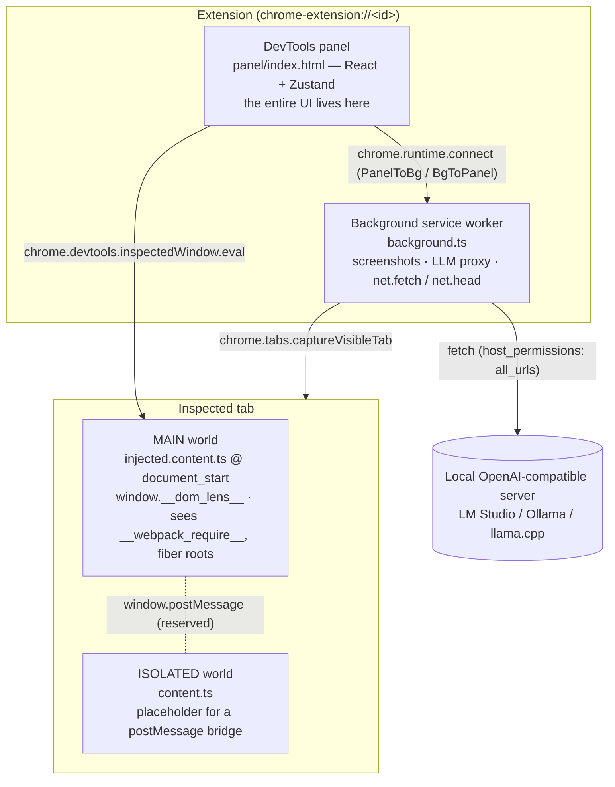
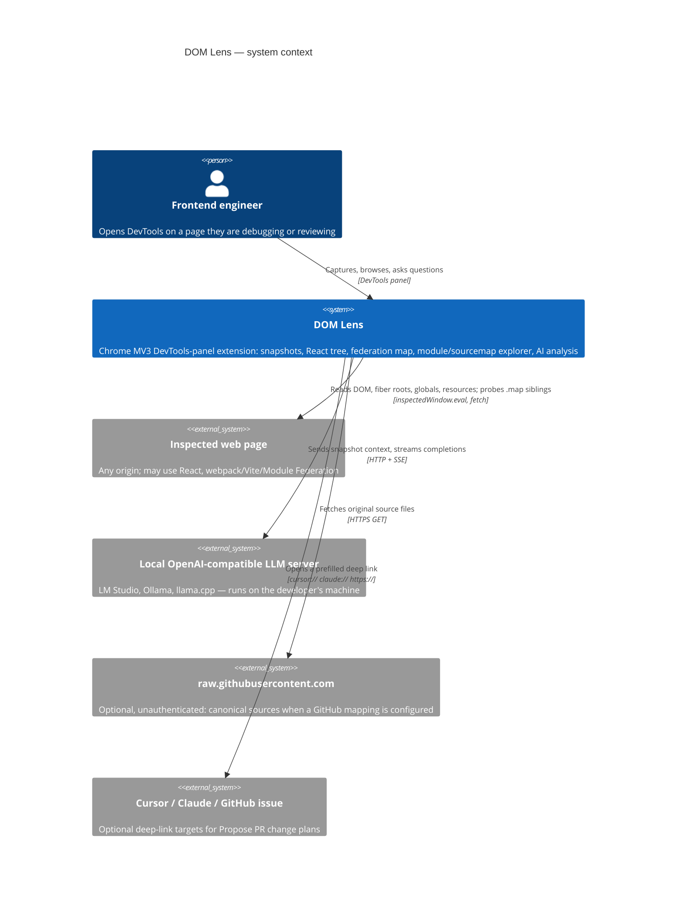
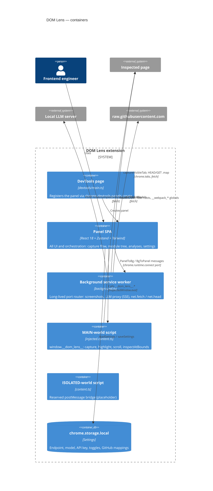
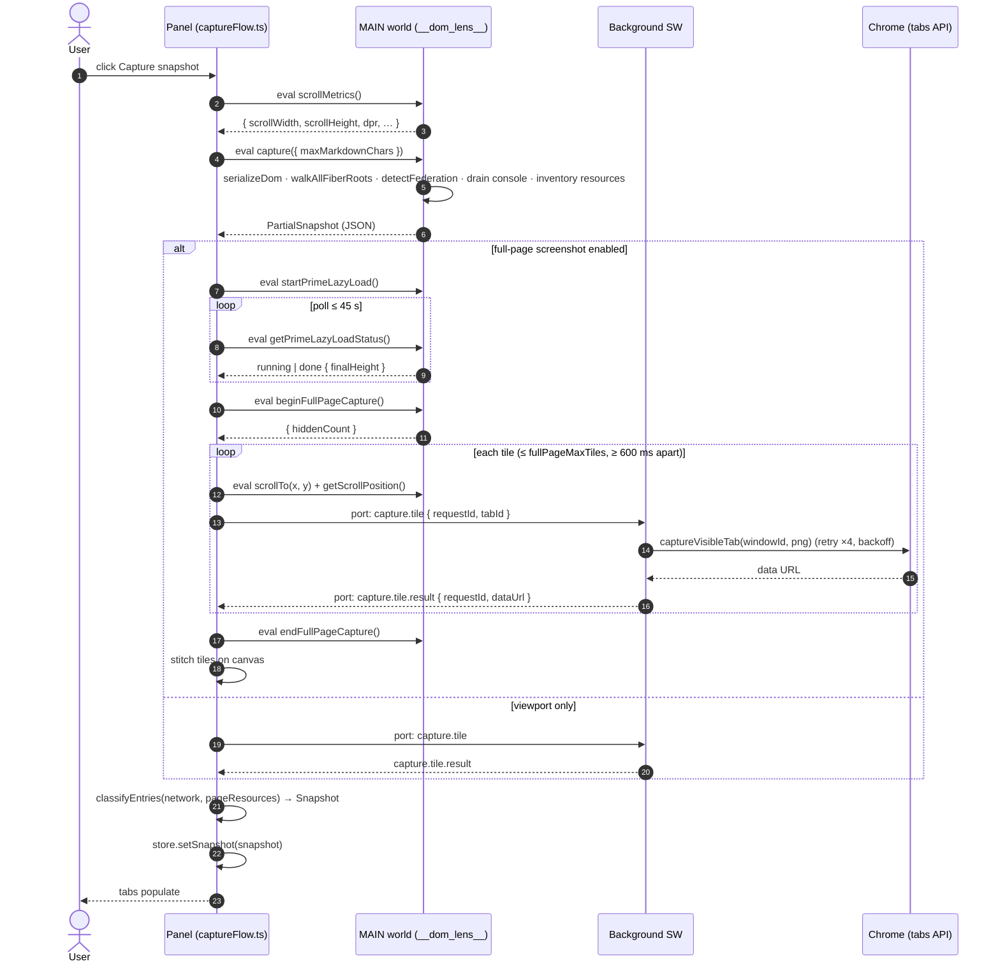
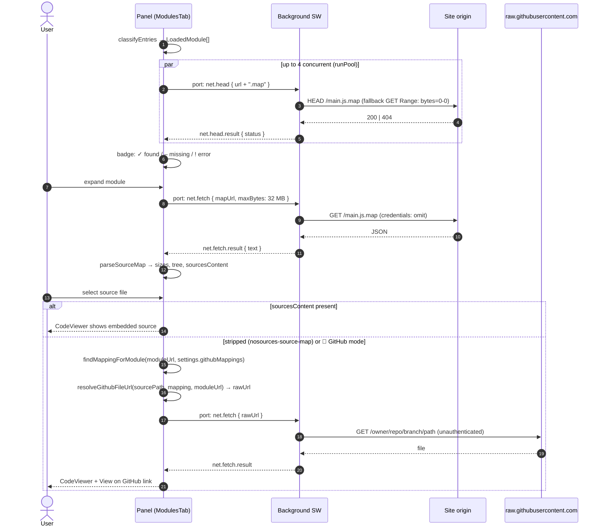
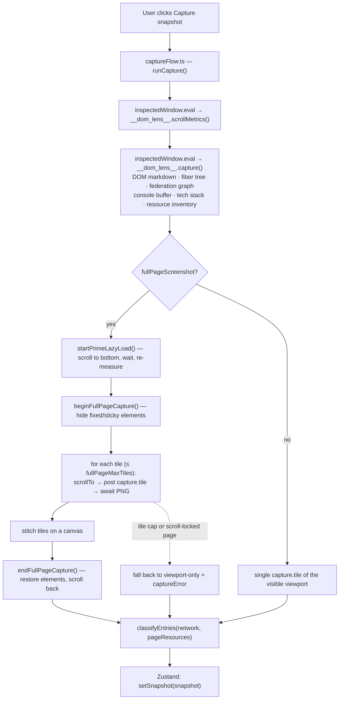
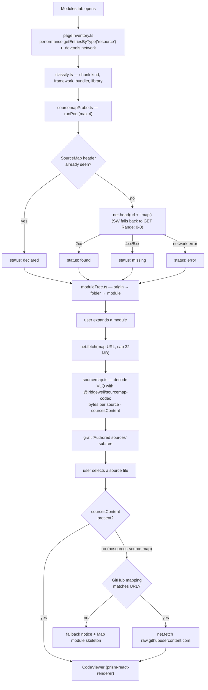

# DOM Lens — Architecture

## Overview

DOM Lens is a Chrome MV3 DevTools extension. There are four distinct execution contexts at runtime; understanding which code runs where is the key to understanding the whole system.



Only the service worker talks to the network; only the MAIN-world script touches page globals; the panel orchestrates both. See the [C4 views](#c4-views) below for the system boundary and the [sequence diagrams](#sequence-diagrams) for the two main flows.
---

## Entrypoints

### `entrypoints/injected.content.ts` — MAIN world

Declared as a content script with `world: 'MAIN'` and `run_at: 'document_start'`. This means it runs before any page JS and has full access to the page's global scope.

Key responsibilities:
- **React DevTools hook shim**: installs `window.__REACT_DEVTOOLS_GLOBAL_HOOK__` so React registers its fiber root before the panel tries to walk it.
- **Console patching**: wraps `console.error`, `console.warn`, `console.log` to buffer entries for capture.
- **`window.__dom_lens__` API surface**: the Panel calls into this via `inspectedWindow.eval`.
  - `capture()` — serializes DOM to Markdown, walks fiber tree, detects Module Federation, drains console buffer, reads viewport metrics.
  - `highlight(x, y, w, h, label, color)` — draws an overlay `<div>` on the page.
  - `clearHighlight()` — removes the overlay.
  - `scrollToBounds(x, y, w, h)` — smooth-scrolls the viewport to center the given rectangle.
  - `inspectAtBounds(x, y, w, h)` — `elementFromPoint` + ancestor walk-up (≥60% area coverage), returns element identity + 25 computed styles + matching CSS rules.

### `entrypoints/content.ts` — ISOLATED world

Minimal placeholder. Receives `window.postMessage` with `channel: 'dom-lens'` for future bridging if the `inspectedWindow.eval` path is unavailable (e.g., pages that block all eval via CSP).

### `entrypoints/background.ts` — Service worker

Long-lived port router. All panel↔page coordination goes through here.

Message types handled:

| PanelToBg type | What the SW does |
|---|---|
| `panel.hello` | Registers `tabId` → `port` mapping |
| `capture.tile` | `chrome.tabs.captureVisibleTab` → returns PNG data URL |
| `lm.chat.start` | Opens streaming SSE to AI server; forwards `lm.chat.delta` / `lm.chat.done` / `lm.chat.error` |
| `lm.chat.cancel` | Aborts in-flight stream via `AbortController` |
| `lm.test` | `GET /models` health check → `lm.test.result` |
| `net.fetch` | `fetch(url)` → returns text body (used to download sourcemaps) |
| `net.head` | `fetch(url, {method:'HEAD'})` → returns status + headers (sourcemap probe) |
| `lm.oneshot` | One-shot (non-streaming) LLM call → `lm.oneshot.result` |
| `lm.stream` | Streaming LLM call → `lm.stream.delta` / `lm.stream.done` / `lm.stream.error` |
| `lm.stream.cancel` | Aborts streaming request |

### `entrypoints/devtools/` — DevTools page

`index.html` + `main.ts` call `chrome.devtools.panels.create('DOM Lens', …)` to register the panel. This is the only page that can call `chrome.devtools.*` APIs.

### `entrypoints/panel/` — Panel React app

React 18 SPA. `App.tsx` owns the top-level port connection and routes all `BgToPanel` messages to the correct waiting `Promise` resolvers (waiter maps keyed by `requestId`). This gives the rest of the panel a simple async API:

```ts
// fetches a sourcemap and resolves to { ok, text }
const result = await fetchText(url);

// fires a streaming LLM call, calling onDelta for each token
const cancel = streamingOneshot(payload, { onDelta, onDone, onError });
```

---

## C4 views

### Level 1 — System context



### Level 2 — Containers (runtime execution contexts)



---

## Sequence diagrams

### Capture: panel → background → MAIN world



Every port request carries a UUID `requestId`; `App.tsx` keeps a `Map<requestId, resolver>` per message family so concurrent requests never cross wires.

### Sourcemap probe and GitHub mapping



---

## Message protocol

Defined in `lib/bridge/protocol.ts`. All messages are plain discriminated union objects — no serialization library.

```ts
type PanelToBg =
  | { type: 'panel.hello'; tabId: number }
  | { type: 'capture.tile'; requestId: string; tabId: number }
  | { type: 'lm.chat.start'; requestId: string; payload: LmChatPayload }
  | { type: 'lm.chat.cancel'; requestId: string }
  | { type: 'lm.test'; baseUrl: string; apiKey?: string }
  | { type: 'net.fetch'; requestId: string; url: string; maxBytes?: number }
  | { type: 'net.head'; requestId: string; url: string }
  | { type: 'lm.oneshot'; requestId: string; payload: LmChatPayload }
  | { type: 'lm.stream'; requestId: string; payload: LmChatPayload }
  | { type: 'lm.stream.cancel'; requestId: string };

type BgToPanel =
  | { type: 'capture.tile.result'; requestId: string; ok: true; dataUrl: string }
  | { type: 'capture.tile.result'; requestId: string; ok: false; message: string }
  | { type: 'lm.chat.delta'; requestId: string; text: string }
  | { type: 'lm.chat.done'; requestId: string }
  | { type: 'lm.chat.error'; requestId: string; message: string }
  | { type: 'lm.test.result'; ok: boolean; models?: string[]; message?: string }
  | { type: 'net.fetch.result'; ... }
  | { type: 'net.head.result'; ... }
  | { type: 'lm.oneshot.result'; ... }
  | { type: 'lm.stream.delta'; requestId: string; text: string }
  | { type: 'lm.stream.done'; requestId: string; fullText: string }
  | { type: 'lm.stream.error'; requestId: string; message: string };
```

Every request carries a `requestId` (UUID). `App.tsx` maintains four `Map<string, resolver>` refs to match responses to callers without any global state.

---

## Capture flow


The scroll-and-stitch path hides fixed/sticky elements before capturing tiles (they'd appear in every tile), re-shows them after, and smooth-scrolls with a re-measure pass to handle lazy-loaded content changing the page height.

---

## LLM proxy design

The panel cannot `fetch` a local AI server directly because:
1. The panel's origin is `chrome-extension://<id>` — the AI server's CORS policy almost certainly doesn't allow this origin.
2. Even if CORS headers are permissive, Chrome sends a preflight `OPTIONS` request which most local AI servers don't handle.

**Solution**: all AI calls go through the background service worker, which has `host_permissions: ['<all_urls>']`. The SW's `fetch` is not subject to the same CORS restrictions as the panel's `fetch`.

Two LLM call patterns:

| Pattern | Port messages | Use case |
|---|---|---|
| **Chat** (`lm.chat.start`) | `lm.chat.delta` × N + `lm.chat.done` | AnalyzeTab main chat |
| **Streaming oneshot** (`lm.stream`) | `lm.stream.delta` × N + `lm.stream.done` | Module/file/UX analyses |
| **Oneshot** (`lm.oneshot`) | `lm.oneshot.result` | Single-pass (non-streaming) tasks |

The streaming paths use an `AbortController` per `requestId` so any in-flight request can be cancelled cleanly.

---

## LlmContext

`lib/lm-studio/LlmContext.tsx` exposes `streamingOneshot` via a React Context so any component in the tree can trigger a streaming LLM call without prop drilling. The `<LlmProvider>` wraps `App`; `useLlm()` is the consumer hook.

Used by:
- `MermaidBlock` (Heal-with-AI)
- `ArtifactBlock` (Refine-with-AI)
- Any future leaf component that needs ad-hoc LLM access

---

## Sourcemap pipeline


**CSP constraint**: `source-map-js` uses `new Function(...)` for VLQ decoding — blocked by the extension page CSP. Replaced with `@jridgewell/sourcemap-codec` (pure JS, no eval).

---

## Session memory

`lib/memory/sessionMemory.ts` — in-memory only (no `chrome.storage`), keyed by `pageKey(url) = origin + pathname`.

Budget model:
- Per-entry cap: 6 KB (text truncated with `…(truncated to fit memory budget)` marker)
- Total budget: 24 KB per page key (oldest entries dropped FIFO when adding a new one would exceed budget)

Prompt injection: `formatMemoryForPrompt(entries)` emits a `## Memory from prior analyses` section, prepended to the user message so the model reads prior context before the current question.

---

## Content Security Policy

The extension panel page has a strict MV3 CSP. Key constraints:
- No `eval`, `new Function`, or `unsafe-eval` — rules out many JS source-map libraries
- No inline `<script>` in HTML — all code is bundled by WXT/Vite
- `sandbox="allow-scripts"` on artifact iframes — no `allow-same-origin`, so iframes run at null origin and cannot call any `chrome.*` API

---

## State management

Zustand store (`entrypoints/panel/store.ts`). Single flat store; no slices.

Major state buckets:

| Key | Type | Purpose |
|---|---|---|
| `tab` | `Tab` | Active top-level tab |
| `snapshot` | `Snapshot \| null` | Last captured page snapshot |
| `settings` | `Settings` | AI endpoint, model, toggles |
| `memoryByPage` | `Record<string, MemoryEntry[]>` | Per-page session memory |
| `chatMessages` | `ChatMessage[]` | AnalyzeTab transcript |
| `modules` | `ModuleEntry[]` | Classified page assets |

Settings are persisted to `chrome.storage.local` via `lib/storage/settings.ts`; all other state is ephemeral (lost on DevTools close).

---

## Design decisions

Each decision below is also recorded as a dated ADR in [`docs/adr/`](adr/README.md) with context, alternatives and consequences.

### Why `inspectedWindow.eval` instead of a content script bridge?

`inspectedWindow.eval` with `{ useContentScriptContext: false }` runs directly in the page's MAIN world — exactly where `__REACT_DEVTOOLS_GLOBAL_HOOK__`, `__webpack_require__`, and `window.__dom_lens__` live. A content script runs in the ISOLATED world and would need a `window.postMessage` bridge to reach MAIN-world globals, adding latency and complexity.

### Why not `chrome.debugger`?

`chrome.debugger` attaches the DevTools protocol and shows a yellow "Chrome is being debugged" bar in the inspected tab — visible and alarming to end users. DOM Lens avoids it by patching `console.*` and listening for `window` `error` / `unhandledrejection` events in the injected script instead. The trade-off: output from cross-origin iframes and web workers is not seen.

### Why replace `source-map-js` with `@jridgewell/sourcemap-codec`?

`source-map-js` uses `new Function(…)` to construct the VLQ decoder — blocked by the MV3 extension page CSP. `@jridgewell/sourcemap-codec` is a pure-JS alternative with no eval.

### Why no PAT storage for GitHub mappings?

Storing a GitHub Personal Access Token in `chrome.storage` creates an attack surface (any content script in a compromised extension could read it). All GitHub fetches are unauthenticated reads of public raw.githubusercontent.com URLs. Propose-PR plans are inert Markdown handed off to external tools (Cursor/Claude/GitHub) — the token never touches the extension.

### Why keep the tree mounted with `display:none`?

`react-arborist` uses a `ResizeObserver` to measure the tree container. Unmounting it on tab switch destroys the observer; when the tree remounts it measures zero and stays miniaturised. Hiding with CSS preserves the observer without re-rendering.
